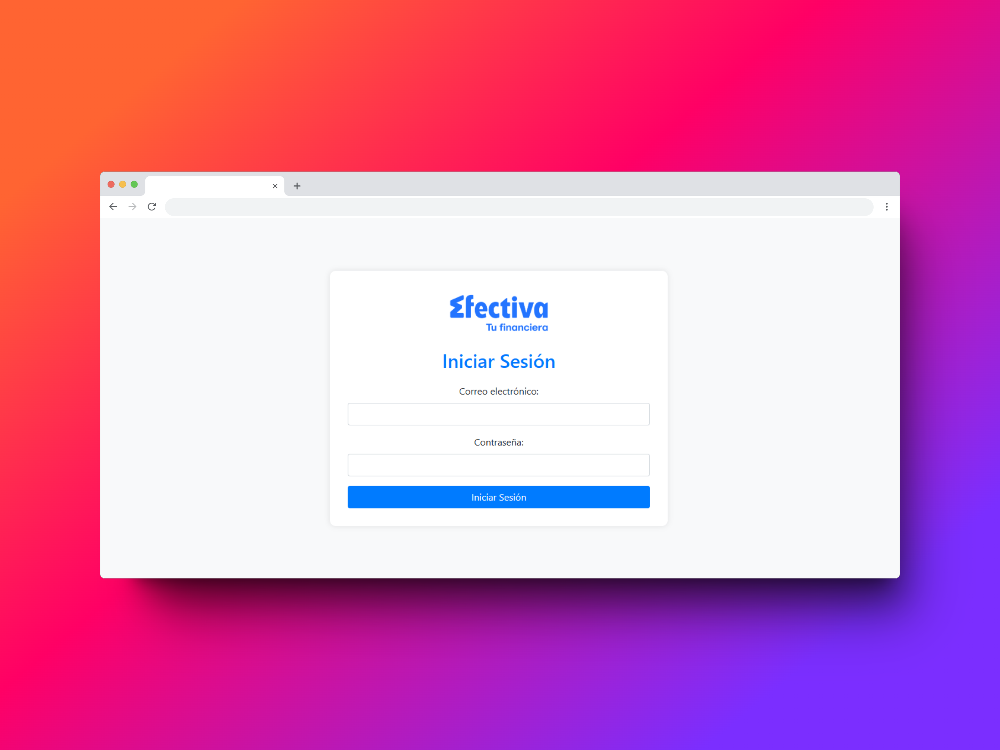
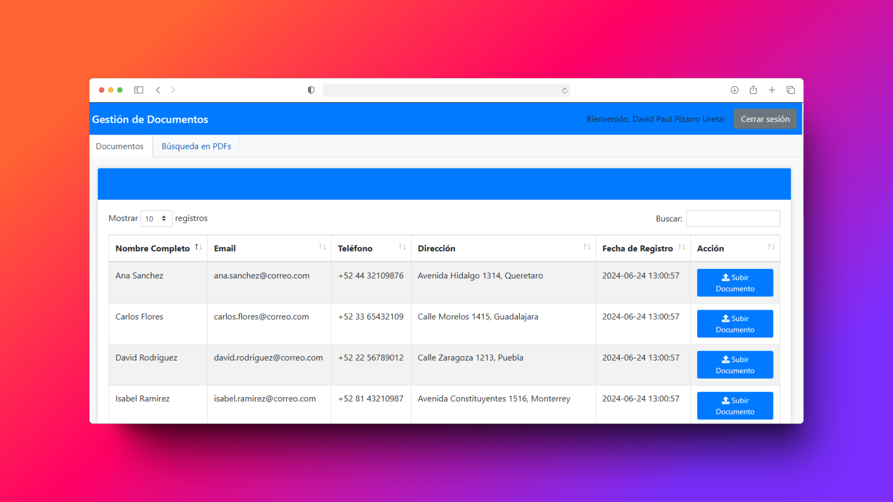
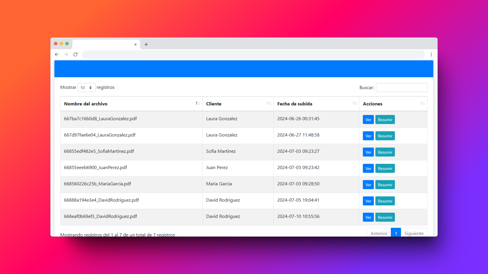

# 🔒 **PDF Management System**

## 📜 **Descripción**

Este sistema está diseñado para almacenar y encriptar archivos PDF de manera segura. Además, soporta almacenamiento RAID para garantizar la redundancia y la seguridad de los datos. El backend está desarrollado en **PHP** y se utiliza **Python** para generar resúmenes de los archivos PDF.

## 🚀 **Funcionalidades**

- **Almacenamiento Seguro**: Los archivos PDF se almacenan y encriptan para garantizar la confidencialidad.
- **Almacenamiento RAID**: Implementación de RAID para asegurar la redundancia y protección de los datos.
- **Resúmenes de PDFs**: Generación de resúmenes automáticos de los archivos PDF utilizando Python.
- **Interfaz Web**: Una interfaz web intuitiva para cargar, gestionar y visualizar archivos PDF.

## 📸 **Capturas de Pantalla**

### 🖥️ Interfaz Principal


### 📂 Gestión de PDFs


### 🔑 Encriptación de Archivos


## ⚙️ **Instalación**

1. Clonar el repositorio:

   ```bash
   git clone https://github.com/tu_usuario/tu_repositorio.git
